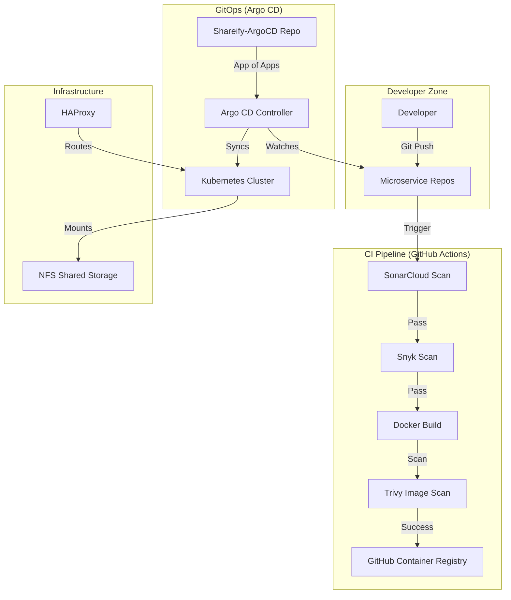

# Shareify Architecture: End-to-End Flow 🚀

This document explains the internal workings of the Shareify Poly-repo ecosystem, covering CI/CD, Security, and GitOps.

## 1. High-Level Architecture Diagram

## 2. The Development Flow (Poly-repo)
We migrated from a Monorepo to **9 independent repositories**. 
- **Benefits**: Independent scaling, faster builds, and isolated failures.
- **Components**: 8 Backend/Frontend services + 1 Infrastructure repo.

## 3. The DevSecOps Pipeline
Every time you push code, the following security checks occur automatically:
1. **SonarCloud (SAST)**: Analyzes your Python code for bugs and security vulnerabilities.
2. **Snyk (SCA)**: Checks your `requirements.txt` for known vulnerabilities in third-party libraries (e.g., PyJWT, Starlette).
3. **Trivy (Container Scan)**: Scans the final Docker image for OS-level vulnerabilities before it is pushed.
4. **Email Alerts**: You receive an email notification for every success or failure at each stage.

## 4. Continuous Deployment (GitOps)
We use **Argo CD** to ensure the cluster matches the state of your Git repositories.
- **App of Apps Pattern**: One "Root Application" manages all 9 microservice applications.
- **Automated Sync**: When you update a Helm chart or image tag in Git, Argo CD automatically applies the change to the cluster.
- **Immutable Infrastructure**: If someone manually changes something in the cluster, Argo CD will automatically "heal" it back to the state defined in Git.

## 5. Kubernetes Storage & Networking
- **StatefulSets**: We use StatefulSets for backend services to ensure they safely handle individual SQLite database files.
- **NFS-CSI Driver**: We use the modern CSI (Container Storage Interface) driver for NFS. This allows Kubernetes to dynamically manage volumes and ensures all microservices can share data reliably across different nodes.
- **HAProxy**: Acts as the "Front Door," receiving internet traffic and sending it to the Kubernetes Gateway.

## 6. Accessing the Application
- **Registry**: `ghcr.io/shareify-project/`
- **Secrets**: Managed via `imagePullSecrets` (ghcr-secret) in each namespace.
- **Environment**: Separated into `shareify-dev` and `shareify-prod`.
